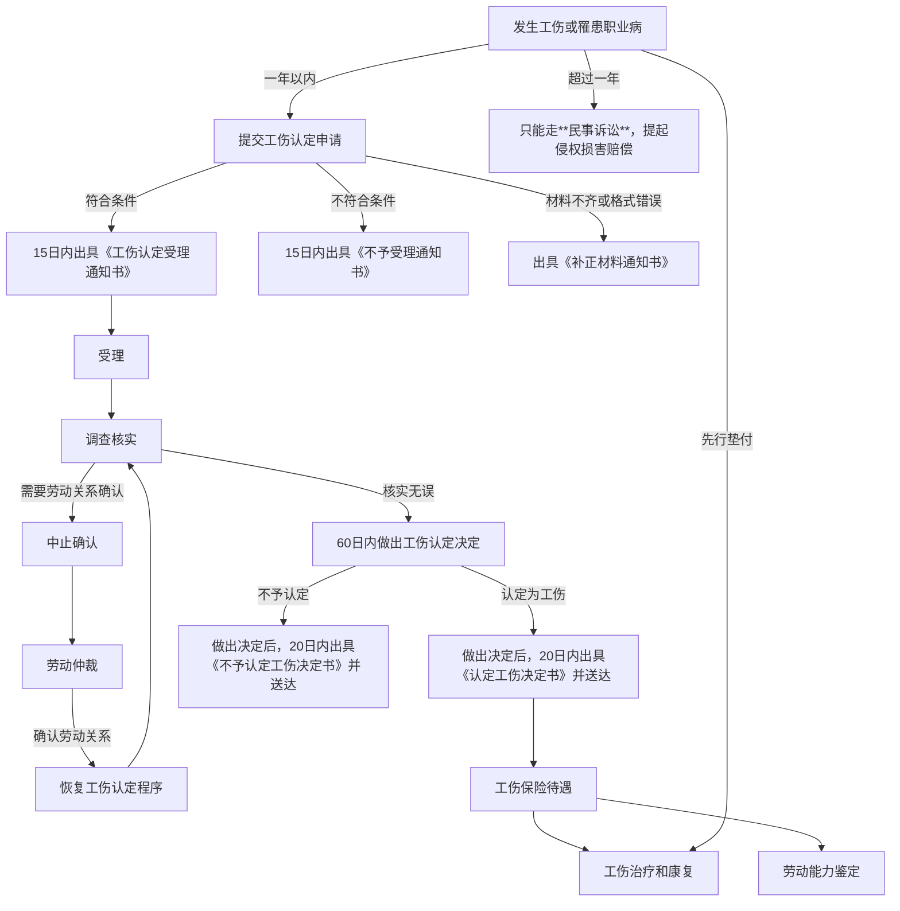

---
{"dg-publish":true,"permalink":"/QA/工伤认定流程/"}
---

```mermaid
graph TD
    A[发生工伤或罹患职业病] -->|一年以内| B[提交工伤认定申请]
    A -->|超过一年| Q[只能走**民事诉讼**，提起侵权损害赔偿]
    B -->|符合条件| C[15日内出具《工伤认定受理通知书》]
    B -->|不符合条件| D[15日内出具《不予受理通知书》]
    B -->|材料不齐或格式错误| E[出具《补正材料通知书》]

    C --> F[受理]
    F --> G[调查核实]
    G -->|核实无误| H[60日内做出工伤认定决定]
    G -->|需要劳动关系确认| I[中止确认]
    
    I --> J[劳动仲裁]
    J -->|确认劳动关系| K[恢复工伤认定程序]
    K --> G

    H -->|认定为工伤| L[做出决定后，20日内出具《认定工伤决定书》并送达]
    H -->|不予认定| M[做出决定后，20日内出具《不予认定工伤决定书》并送达]

    L --> N[工伤保险待遇]
    N --> O[工伤治疗和康复]
    N --> P[劳动能力鉴定]
    A --> |先行垫付|O

```
