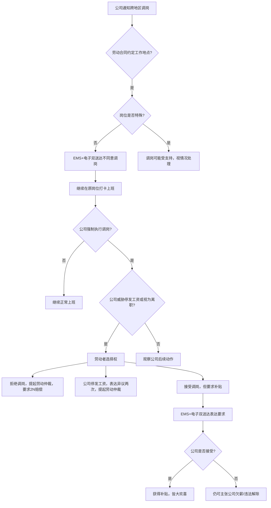

一般情况下，工作地点属于劳动合同的约定项，未经劳动者同意公司无权擅自变更。但同时又有所谓“企业用工自主权”的规定，这使得某些条件下，公司的跨地区调岗受到法律支持。具体来说，不跨市的调岗一般会受到仲裁庭的支持。此外，有些岗位（比如一些技术人员）由于其本身的特殊性，客观而言需要在不同工作地点工作，那么公司的跨地区调岗可能受到支持。

因此，如果我们的劳动合同明确约定了工作地点，而且劳动者不属于某些特殊岗位，那么我们就可以首先通过[[EMS+电子双送达\|EMS+电子双送达]]的方式表达不同意调岗的意见，在此期间，我们继续在原岗位打卡上班，千万不要先认怂到新岗位！有些地区的仲裁庭会以劳动者已经到新岗位打卡为理由，认定劳动者默认接受调岗。如果公司执意对劳动者进行调岗，并通知劳动者若不到新岗位工作则视为自行离职或停发工资，那么此时选择权仍在我们劳动者手中，我们可以选择：1.拒绝调岗并放弃这份工作，以公司违法解除为由向公司提起劳动仲裁，要求公司支付2n的赔偿金；2.若公司停发公司，我们还应当就工资不足额向工资表达异议（同样使用[[EMS+电子双送达\|EMS+电子双送达]]方式），在两次表达异议均得不到回复后提起劳动仲裁请求支付工资差额；3.接受调岗，但前提是公司为此调岗行为付出代价，比如租房补贴、交通补贴、伙食补贴、涨工资等等，此时可以再通过[[EMS+电子双送达\|EMS+电子双送达]]的方式向公司表达接受调岗并要求各种补贴的要求，如果公司愿意接受，那么皆大欢喜，如果公司不接受这些条件，那么我们仍然主张公司欠薪/违法解除。此外，公司若以外派为由，要求劳动者长期异地工作，也可以如上流程表达异议/要求补贴。

Q：公司要求我去外地，我应该怎样拒绝？

A：核心思路是**要补贴**。比如我在这里租了一个房子，那么我需要租房补贴；我来回坐飞机，那么我需要交通补贴；食堂的饭菜吃的我腹泻，那么我必须到外边吃饭，我需要伙食补贴。总而言之，**增大公司的成本**。

Q：在约定不明确的情况下，具体如何操作才能在庭审中取得优势呢？  
A：在庭审中可以主张“xx 在xx 公司工作已xx 年，入职以来工作地点一直固定在xx区，表明双方在长期的实践中，已经将xx 区作为劳动合同的具体履行地，应认定该地为劳动合同约定的工作地点。xx长期在xx区生活，已经形成较为稳定的住所和社会关系，xx工作地点的变更，不仅会引起其本人工作和生活的变化，亦会导致其家人要重新适应新环境的变化。公司在对xx工作地点进行超出其心理预期的重大调整前，应当与xx协商一致。”

Q：如果属于集体调整，那么怎么办？  
A：我们一般会经历这样的流程：

1. 首先公司通知我们去新工作地点上班，并提出一些补偿，告知我们工资待遇不会降低

2. 然后我们拒绝调整，公司再次通知我们，这次要我们限期上班，否则视为违纪

3. 最后，我们一直拒绝上班或被迫离职，公司以违反规章制度为由对我们进行开除

4. 争议发生后，我们去仲裁主张非法辞退2n或被迫离职n。

由于情况对于劳动者极其不利，我们建议依据《[[劳动合同法\|劳动合同法]]》第四十条，证明和公司协商不一致后解除劳动合同，然后拿到n+1的经济补偿金。具体的操作是：

积极和公司协商，不要直接拒绝调岗。（体现我们履行了法律要求的协商义务）例如，可以要求增加通勤补贴、增加班车等等，直到你可以接受；如果你和公司都不接受，就发出通知书（主要内容是由于协商无法达成一致，建议公司考虑依照《[[劳动合同法\|劳动合同法]]》第四十条支付本人xxx元的经济补偿金），然后等待公司解除劳动关系就好了。