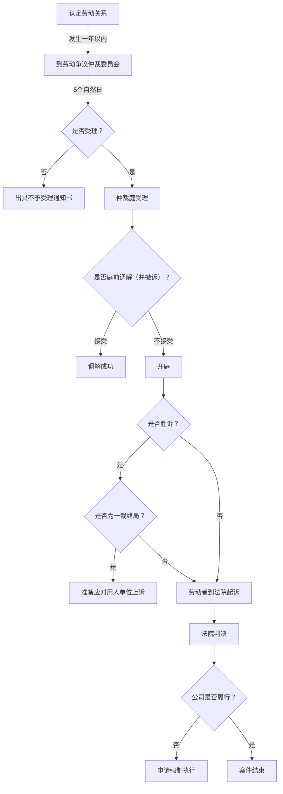

```mermaid
graph TD;
    A[认定劳动关系] -->|发生一年以内| B[到劳动争议仲裁委员会]
    B -->|5个自然日| C{是否受理？}
    C --否--> D[出具不予受理通知书]
    C --是--> E[仲裁庭受理]
    E --> F{是否庭前调解（并撤诉）？}
    F --接受--> G[调解成功]
    F --不接受--> H[开庭]
    H --> I{是否胜诉？}
    I --是--> J{是否为一裁终局？}
    J --是--> K[准备应对用人单位上诉]
    J --否--> L[劳动者到法院起诉]
    I --否--> L
    L --> M[法院判决]
    M --> N{公司是否履行？}
    N --否--> O[申请强制执行]
    N --是--> P[案件结束]

```

![[劳动仲裁.drawio]]

[[法条/部门规章/劳动人事争议仲裁办案规则\|劳动人事争议仲裁办案规则]]